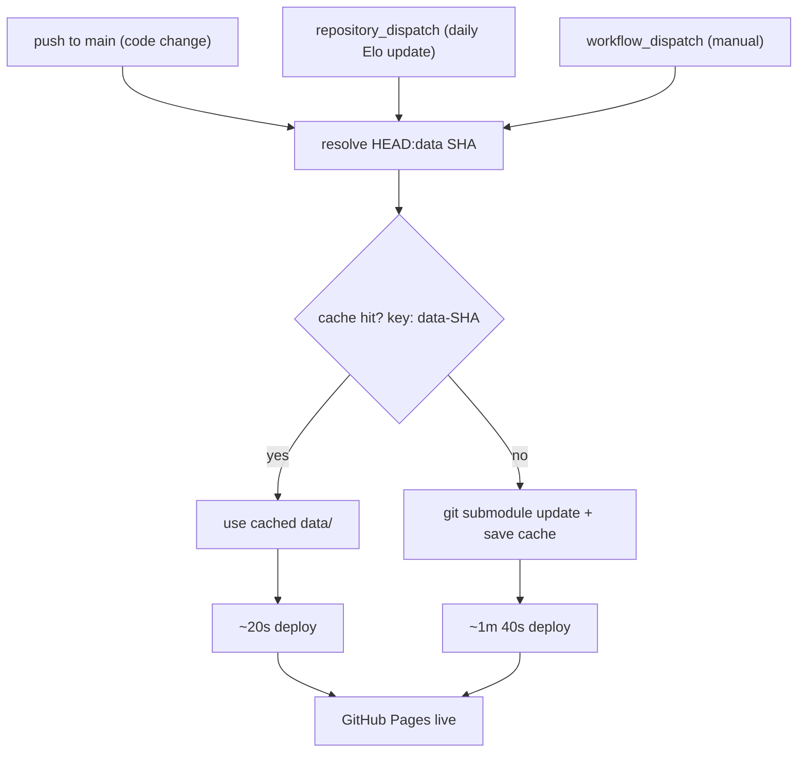

# mundial

Static frontend for the [Born In, Plays For](https://github.com/born-in-plays-for) project — interactive D3.js choropleth map of the 2026 FIFA World Cup showing where players were born vs. which country they represent.

**Live at [mundial.cthiebaud.com](https://mundial.cthiebaud.com/)**

## Pages

| URL | Description |
|---|---|
| [/](https://mundial.cthiebaud.com/) | Entry point — redirects to the map |
| [/wc2026_map.html](https://mundial.cthiebaud.com/wc2026_map.html) | Main choropleth map |
| [/wc2026_countries.html](https://mundial.cthiebaud.com/wc2026_countries.html) | Countries reference table |
| [/wc2026_live.html](https://mundial.cthiebaud.com/wc2026_live.html) | Live game tracking (requires backend) |
| [/guide.html](https://mundial.cthiebaud.com/guide.html) | User guide |
| [/chains/wc2026_chain_longest.html](https://mundial.cthiebaud.com/chains/wc2026_chain_longest.html) | Export chain snake renderer |
| [/insights/france.html](https://mundial.cthiebaud.com/insights/france.html) | France departments choropleth |
| [/insights/perf.html](https://mundial.cthiebaud.com/insights/perf.html) | Regional performance analysis |

## Running locally

```bash
python3 -m http.server 8000
# open http://localhost:8000/
```

The map uses `fetch()` and requires an HTTP server — `file://` will not work.

After cloning, initialise the data submodule:

```bash
git submodule update --init
```

**Tip:** Configure git to automatically update submodules on pull:
```bash
git config submodule.recurse true
```
This eliminates the need to manually run `git submodule update` after each pull.

## Data

All data files live in the `data/` directory, which is a git submodule pointing to [mundial-data](https://github.com/born-in-plays-for/mundial-data):

| File | Contents |
|---|---|
| `map_data.json` | Player export/import data, populations, capitals |
| `elo_rank.json` | Elo rankings for all 48 qualified countries |
| `r32_teams.json` | Round-of-32 squad data |
| `uk-nations.geojson` | England, Scotland, Wales, Northern Ireland polygons |

Data is updated daily by the [mundial-build](https://github.com/born-in-plays-for/mundial-build) pipeline and automatically deployed via GitHub Actions.

## Deploy

GitHub Actions deploys to Pages on every push. The `data/` submodule is cached by its commit SHA so code-only pushes are fast — the heavy submodule fetch only runs when the data actually changes.



A cache miss happens only on the first deploy after a data submodule bump — the fresh fetch saves the cache, so the next code push hits it immediately.

## Tech stack

All dependencies from jsDelivr CDN — no build step:

| Package | Purpose |
|---|---|
| D3 7 | Map rendering, zoom, data joins |
| lit-html 3 | HTML templating (all dynamic HTML) |
| Bootstrap 5 | Responsive layout |
| topojson-client | GeoJSON extraction |
| circle-flags / flag-icons | Country flag SVGs |
| iso-3166-1 | Country code lookups |
| socket.io-client 4 | WebSocket (auth + live game) |
| world-atlas | 110m TopoJSON world map |

## i18n

UI language follows the browser locale. Supported: French, German, Italian, Spanish, English (fallback). Country names via `Intl.DisplayNames`. Wikipedia player links in all five languages.

## See also

- [born-in-plays-for](https://github.com/born-in-plays-for) — org overview + architecture diagram
- [mundial-data](https://github.com/born-in-plays-for/mundial-data) — shared data files (submodule)
- [mundial-build](https://github.com/born-in-plays-for/mundial-build) — data pipeline
- [mundial-server](https://github.com/born-in-plays-for/mundial-server) — backend
