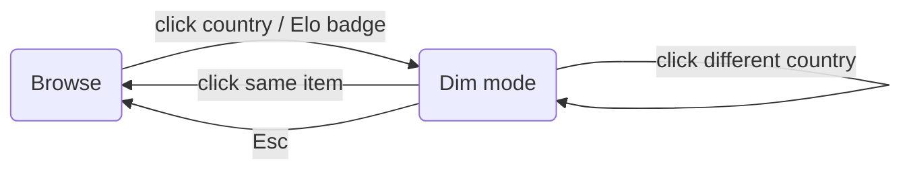

<!-- i18n:page_title -->
# User's Guide
<!-- /i18n:page_title -->

<!-- i18n:intro -->
This map visualises the 2026 FIFA World Cup squads through the lens of birthplace.
Each country is shaded by how many players born there represent **another** country
at the tournament, normalised per million inhabitants.
<!-- /i18n:intro -->

<!-- i18n:control_sidebar -->
## The Filter & Sort Panel

The **‹** button in the top-right corner of the header opens the filter and sort panel,
which controls which countries appear in the Elo ranking list below the map.

*Sort column (left) and filter matrix (right) — click any row or column header to toggle a whole group.*

### The filter matrix

Rows group countries by qualification status; columns select by export/import role.
Click the column header `exp.` to show only exporting countries;
click `qualif.` to toggle all qualified nations at once.
<!-- /i18n:control_sidebar -->

<!-- i18n:interaction_flow -->
## Interaction Model

Click any country on the map — or any badge in the Elo list — to enter **dim mode**:
unrelated flags fade, arcs show export flows, and the player table appears below the map.

*Clicking the same item again always returns to Browse.*

> **Tip:** clicking the active Elo badge a second time clears dim mode without moving the map.
<!-- /i18n:interaction_flow -->

<!-- i18n:data_sources -->
## Data Sources

| Source | Used for |
|---|---|
| [Wikipedia](https://wikipedia.org) squad pages | Player names, birth countries, cap counts |
| [eloratings.net](https://www.eloratings.net/) | World Football Elo rankings |
| [World Bank](https://data.worldbank.org/) | Country populations |
<!-- /i18n:data_sources -->
