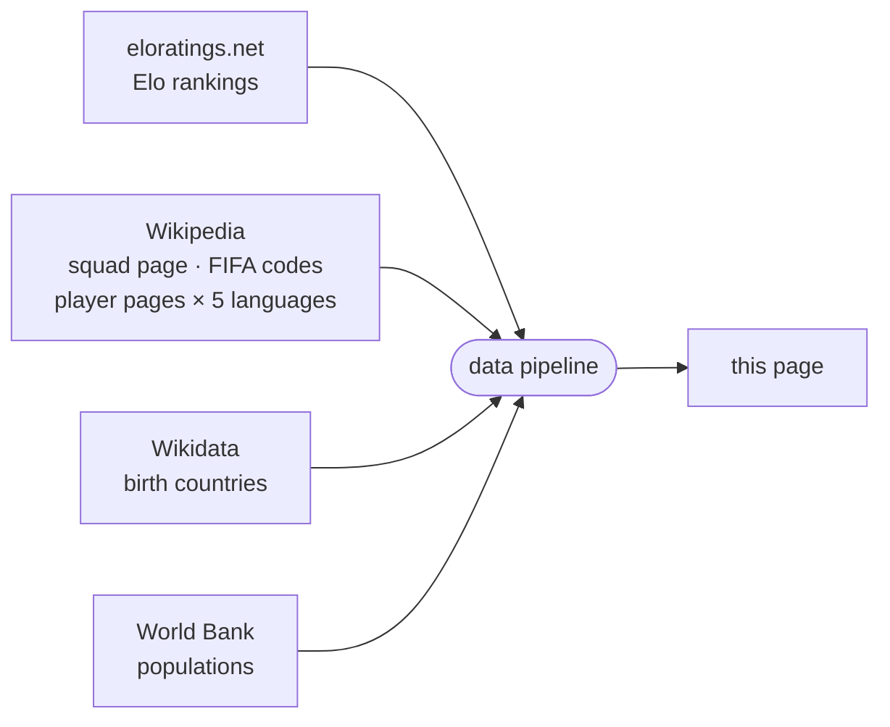

<!-- i18n:page_title -->
# Nacido en / Juega para
<!-- /i18n:page_title -->

<!-- i18n:intro -->
Este mapa visualiza las convocatorias del Mundial 2026 desde la perspectiva del lugar de nacimiento.
Cada país se colorea según el número total de jugadores del torneo nacidos allí —
ya sea que representen a ese país o a otro.
<!-- /i18n:intro -->

<!-- i18n:quotes -->
## Las citas

El encabezado muestra un carrusel rotativo de 15 famosas citas literarias —
de François Villon (1461) a Simone de Beauvoir (1949) — cada una reescrita con humor
para sustituir la expresión clave original por un término de selección futbolística.

Navega entre las citas usando los chevrones orientados hacia la izquierda, o desliza hacia la izquierda / derecha en pantallas táctiles.
Mantén presionado (o mantén el botón del ratón pulsado) sobre una cita para revelar la línea original; suelta para volver.
<!-- /i18n:quotes -->

<!-- i18n:control_sidebar -->
## El panel de filtro y ordenación

El botón <kbd style="background:var(--bg-hover,#f0ede8);border:1px solid var(--border,#e4e0d8);color:var(--text-muted,#999);border-radius:0 4px 4px 0">‹</kbd> en la esquina superior derecha del encabezado abre el panel de filtro y ordenación,
para controlar lo que aparece en el mapa y en la lista de países.

*Matriz de filtro (derecha) — haz clic en un encabezado de fila o columna para alternar todo un grupo a la vez.* *Columna de ordenación (izquierda) — solo los dos primeros criterios están activos; hacer clic en un criterio lo mueve al inicio de la lista.*

### La matriz de filtro

La matriz cruza dos **columnas** (exportador / no exportador) con cuatro **filas** en dos grupos:

- **Clasificados** — según si el país importa jugadores o no
- **No clasificados** — según la membresía FIFA

Desmarca una celda para ocultar esa categoría. Haz clic en un encabezado de fila o columna para alternar todo el grupo a la vez.

### Filtro alive & kicking

El interruptor **in · ● · out** se encuentra justo debajo del encabezado de fila *clasificados*.
Por defecto el cursor está centrado — se muestran los 48 países clasificados.

- Lado **in**: muestra solo los equipos aún en el torneo; los países eliminados se ocultan.
- Lado **out**: muestra solo los equipos eliminados.
- Toca de nuevo el lado activo, o el centro, para restablecer y mostrar todo.

En pantallas táctiles, desliza hacia la izquierda o derecha para mover el cursor paso a paso.

El interruptor funciona en combinación con el resto de la matriz de filtro — puedes, por ejemplo,
mostrar solo supervivientes exportadores cambiando a **in** y desmarcando la columna de no exportadores.

### Sobre la referencia de países

El mapa y la lista usan [eloratings.net](https://www.eloratings.net/) como fuente de países —
no la lista de miembros de la FIFA. Esto significa que la lista incluye territorios no-FIFA como Groenlandia,
pero también casos especiales como las cuatro naciones del Reino Unido — entidades sub-nacionales
con su propia membresía FIFA, reconocidas por separado tanto por la FIFA como por Elo.
El orden predeterminado es por clasificación Elo; otros criterios de ordenación están disponibles en la columna de ordenación.
<!-- /i18n:control_sidebar -->

<!-- i18n:tax_heading -->
## Categorías de países
<!-- /i18n:tax_heading -->

<!-- i18n:tax_intro -->
Cada país se muestra como una **pastilla** cuyo estilo CSS codifica su categoría de un vistazo.
<!-- /i18n:tax_intro -->

<!-- i18n:tax_label_qualified -->
Clasificado vs. no clasificado
<!-- /i18n:tax_label_qualified -->

  
    
    Czech Republic
  
  <!-- i18n:tax_desc_border_yes -->
Borde sólido — clasificado y aún en el torneo.
<!-- /i18n:tax_desc_border_yes -->

  
    
    Iran
  
  <!-- i18n:tax_desc_border_dashed -->
Borde discontinuo — clasificado pero eliminado.
<!-- /i18n:tax_desc_border_dashed -->

  
    
    Ukraine
  
  <!-- i18n:tax_desc_border_no -->
Sin borde — no clasificado.
<!-- /i18n:tax_desc_border_no -->

<!-- i18n:tax_label_fifa -->
FIFA vs. no-FIFA
<!-- /i18n:tax_label_fifa -->

  
    
    Iceland
  
  <!-- i18n:tax_desc_text_dark -->
Texto oscuro — miembro de la FIFA.
<!-- /i18n:tax_desc_text_dark -->

  
    
    Greenland
  
  <!-- i18n:tax_desc_text_light -->
Texto claro — no miembro de la FIFA.
<!-- /i18n:tax_desc_text_light -->

<!-- i18n:tax_label_born -->
Nacido aquí / juega para
<!-- /i18n:tax_label_born -->

  
    
    Italy
  
  ▶ <!-- i18n:tax_desc_exp -->
Jugadores nacidos en este país juegan para otro país clasificado.
<!-- /i18n:tax_desc_exp -->

  
    
    Curaçao
  
  ◀ <!-- i18n:tax_desc_imp -->
Jugadores nacidos en otro país juegan para este país.
<!-- /i18n:tax_desc_imp -->

  
    
    France
  
  ◀▶ <!-- i18n:tax_desc_both -->
Jugadores nacidos en otro país juegan para este país, y jugadores nacidos aquí juegan para otros países.
<!-- /i18n:tax_desc_both -->

<!-- i18n:tax_label_offmap -->
Fuera del mapa
<!-- /i18n:tax_label_offmap -->

<!-- i18n:tax_note_offmap -->
Ortogonal a las categorías anteriores.
<!-- /i18n:tax_note_offmap -->

  
    
    Singapore
  
  <!-- i18n:tax_desc_nomap -->
Nombre en <em>cursiva</em> y bandera atenuada — demasiado pequeño para aparecer en el mapa.
<!-- /i18n:tax_desc_nomap -->

  
    
    Monaco
  
  <!-- i18n:tax_desc_nomap_nonfifa -->
Ídem, aquí combinado con no-FIFA.
<!-- /i18n:tax_desc_nomap_nonfifa -->

<!-- i18n:map -->
## El mapa

### Coropleta y banderas

Cada país se colorea según el número total de jugadores del Mundial nacidos allí —
cuanto más oscuro el tono, más jugadores. Los países donde no nació ningún jugador aparecen en un tono pálido neutro.
Los países actualmente incluidos en el filtro muestran un marcador de bandera circular.

### Zoom y desplazamiento

Desplaza (o pellizca) para hacer zoom · arrastra para mover. El botón  aleja el zoom para que quepan todos los países en la vista.
Cuando hay un país seleccionado, el botón  hace zoom y desplaza para mostrar todos los países resaltados a la vez.

### La leyenda

La barra de color en la parte inferior del encabezado va de oscuro a pálido de izquierda a derecha,
con los valores de referencia **66 · 55 · 35 · 15 · 0**.
Francia (**99**, muy fuera de escala) se muestra como un punto negro independiente a la izquierda de la barra.

### Información emergente

Pasa el cursor sobre cualquier país para ver los detalles. La información emergente no se muestra en móviles.

- **Países de nacimiento**: recuento de exportaciones y mejores jugadores, cada uno con su bandera de destino
- **Países clasificados que también reclutan**: una columna derecha añade el lado de importación
- **Países de nacimiento no clasificados**: un distintivo *no clasificado* reemplaza el panel de convocatoria
<!-- /i18n:map -->

<!-- i18n:bottom_panel -->
## El panel inferior

El área desplazable bajo el mapa tiene tres pestañas.

###  La lista de países

La pestaña predeterminada muestra todos los países como pastillas.
El panel de filtro y ordenación controla qué pastillas aparecen y en qué orden;
el orden predeterminado es por [clasificación Elo mundial](https://www.eloratings.net/).

Hacer clic en una pastilla selecciona ese país y hace zoom en el mapa.

Para países con conexiones **nacido aquí / juega para**, también aparecen flechas de colores en el mapa:

- {{ARROW_BLUE}} **flechas azules**: selecciones que incluyen jugadores nacidos en el país seleccionado
- {{ARROW_RED}} **flechas rojas**: países donde jugadores nacidos en otro lugar juegan para esta selección

*El grosor de las flechas es proporcional al número de jugadores.*

El botón  ajusta entonces todos los países conectados en la vista.

Haz clic de nuevo en la pastilla activa, haz clic en otro lugar del mapa, o pulsa **Esc** para deseleccionar.

### La tabla de jugadores

Cuando hay un país seleccionado, la tabla de jugadores muestra tres secciones:

| Sección | Contenido |
|---|---|
| **Nacido aquí / juega para otro** | Jugadores nacidos en este país, agrupados por la selección que representan |
| **Nacido aquí / juega para este país** | Jugadores nacidos aquí que también representan a este país |
| **Nacido en otro lugar / juega para este país** | Jugadores nacidos en otro país que representan a esta selección, agrupados por país de nacimiento |

Los nombres de los jugadores enlazan a su página de Wikipedia en el idioma de la interfaz cuando está disponible.

###  Cadenas

La pestaña de cadenas muestra secuencias de países vinculados por conexiones nacido-aquí / juega-para:
un jugador nacido en A juega para B, un jugador nacido en B juega para C — y así sucesivamente,
formando una cadena de nacionalidades a lo largo del torneo.
<!-- /i18n:bottom_panel -->

<!-- i18n:data_sources -->
## Fuentes de datos

| Fuente | Uso |
|---|---|
| [eloratings.net](https://www.eloratings.net/) | Rankings Elo de fútbol mundial |
| [Wikipedia — convocatorias Mundial 2026](https://en.wikipedia.org/wiki/2026_FIFA_World_Cup_squads) | Nombres de jugadores, internacionalidades |
| [API de Wikipedia](https://en.wikipedia.org/w/api.php) | Página Wikipedia de cada jugador en 5 idiomas (en, fr, de, it, es) |
| [Wikipedia — códigos de países FIFA](https://en.wikipedia.org/wiki/List_of_FIFA_country_codes) | Membresía FIFA |
| [Wikidata](https://www.wikidata.org/) | Países de nacimiento |
| [Banco Mundial](https://data.worldbank.org/) | Poblaciones de los países |

**La resolución del país de nacimiento** es el paso más delicado del pipeline.
La página de convocatorias de Wikipedia no indica dónde nacieron los jugadores — solo proporciona sus nombres
y enlaces a sus páginas individuales de Wikipedia.
El pipeline usa esos enlaces como claves para consultar [Wikidata](https://www.wikidata.org/)
mediante SPARQL, recuperando el lugar de nacimiento registrado de cada jugador y el país al que pertenece ese lugar.
Esta búsqueda en dos pasos (Wikipedia → Wikidata) es lo que hace posible trazar las conexiones nacido-aquí / juega-para en el mapa.

Estas fuentes alimentan un pipeline automatizado que fusiona, cruza y enriquece los datos brutos antes de publicarlos en esta página.
Los rankings Elo se actualizan diariamente; los datos de convocatorias se actualizan manualmente cuando cambian las selecciones.
<!-- /i18n:data_sources -->

