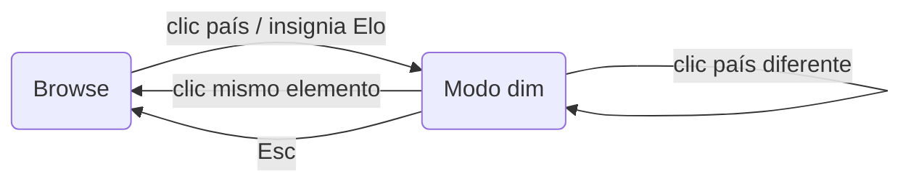

<!-- i18n:page_title -->
# Guía del usuario
<!-- /i18n:page_title -->

<!-- i18n:intro -->
Este mapa visualiza las convocatorias del Mundial 2026 desde la perspectiva del lugar de nacimiento.
Cada país se colorea según el número de jugadores nacidos allí que representan a **otro** país
en el torneo, normalizado por millón de habitantes.
<!-- /i18n:intro -->

<!-- i18n:control_sidebar -->
## Panel de filtro y ordenación

El botón **‹** en la esquina superior derecha del encabezado abre el panel de filtro y ordenación,
que controla qué países aparecen en la lista de clasificaciones Elo debajo del mapa.

*Columna de ordenación (izquierda) y matriz de filtro (derecha) — haz clic en un encabezado de fila o columna para alternar todo un grupo.*

### La matriz de filtro

Las filas agrupan países por estado de clasificación; las columnas seleccionan por rol de exportación/importación.
Haz clic en el encabezado de columna `exp.` para mostrar solo los países exportadores;
haz clic en `qualif.` para alternar todas las naciones clasificadas a la vez.
<!-- /i18n:control_sidebar -->

<!-- i18n:interaction_flow -->
## Modelo de interacción

Haz clic en cualquier país del mapa — o en cualquier insignia de la lista Elo — para entrar en el **modo dim**:
las banderas no relacionadas se atenúan, los arcos muestran los flujos de exportación, y la tabla de jugadores aparece debajo del mapa.

*Hacer clic en el mismo elemento siempre vuelve a Browse.*

> **Consejo:** hacer clic dos veces en la insignia Elo activa cancela el modo dim sin mover el mapa.
<!-- /i18n:interaction_flow -->

<!-- i18n:data_sources -->
## Fuentes de datos

| Fuente | Uso |
|---|---|
| Páginas de convocatorias de [Wikipedia](https://wikipedia.org) | Nombres de jugadores, países de nacimiento, internacionalidades |
| [eloratings.net](https://www.eloratings.net/) | Rankings Elo de fútbol mundial |
| [Banco Mundial](https://data.worldbank.org/) | Poblaciones de los países |
<!-- /i18n:data_sources -->
