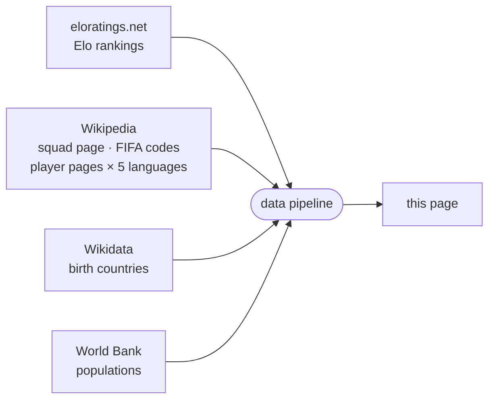

<!-- i18n:page_title -->
# Né en / Joue pour
<!-- /i18n:page_title -->

<!-- i18n:intro -->
Cette carte visualise les effectifs de la Coupe du Monde 2026 sous l'angle du lieu de naissance.
Chaque pays est coloré selon le nombre total de joueurs du Mondial qui y sont nés —
qu'ils représentent ce pays ou un autre.
<!-- /i18n:intro -->

<!-- i18n:quotes -->
## Les citations

L'en-tête affiche un carrousel de 15 citations littéraires célèbres —
de François Villon (1461) à Simone de Beauvoir (1949) — chacune réécrite avec humour
pour remplacer l'expression clé originale par un terme de sélection footballistique.

Naviguez entre les citations à l'aide des chevrons orientés vers la gauche, ou faites glisser vers la gauche / droite sur les écrans tactiles.
Maintenez appuyé (ou gardez le bouton de la souris enfoncé) sur une citation pour révéler la ligne originale ; relâchez pour revenir.
<!-- /i18n:quotes -->

<!-- i18n:control_sidebar -->
## Le panneau de filtre et de tri

Le bouton <kbd style="background:var(--bg-hover,#f0ede8);border:1px solid var(--border,#e4e0d8);color:var(--text-muted,#999);border-radius:0 4px 4px 0">‹</kbd> dans le coin supérieur droit de l'en-tête ouvre le panneau de filtre et de tri,
pour contrôler ce qui apparaît sur la carte et dans la liste des pays.

*Matrice de filtre (droite) — cliquez sur un en-tête de ligne ou de colonne pour basculer tout un groupe d'un coup.* *Colonne de tri (gauche) — seuls les deux premiers critères sont actifs ; cliquer sur un critère le place en tête de liste.*

### La matrice de filtre

La matrice croise deux **colonnes** (exportateur / non-exportateur) avec quatre **lignes** en deux groupes :

- **Qualifiés** — selon que le pays importe des joueurs ou non
- **Non qualifiés** — selon l'appartenance à la FIFA

Décochez une cellule pour masquer cette catégorie. Cliquez sur un en-tête de ligne ou de colonne pour basculer tout le groupe d'un coup.

### Filtre alive & kicking

Le commutateur **in · ● · out** se trouve juste en dessous de l'en-tête de ligne *qualifié*.
Par défaut, le curseur est centré — les 48 pays qualifiés sont affichés.

- Côté **in** : affiche uniquement les équipes encore en lice ; les pays éliminés sont masqués.
- Côté **out** : affiche uniquement les équipes éliminées.
- Touchez à nouveau le côté actif, ou le centre, pour réinitialiser et tout afficher.

Sur écran tactile, faites glisser vers la gauche ou la droite pour déplacer le curseur pas à pas.

Le commutateur fonctionne en combinaison avec le reste de la matrice de filtre — vous pouvez, par exemple,
n'afficher que les équipes encore en lice qui sont aussi exportatrices en passant à **in** et en décochant la colonne non-exportateurs.

### Filtre confédérations FIFA

Le bouton  à côté de la ligne **FIFA** ouvre un menu déroulant pour filtrer la liste sur une seule confédération. Les pays non-FIFA ne sont pas affectés — ils restent visibles ou masqués selon le reste de la matrice de filtre.

La sélection d'une confédération met également en évidence sa frontière externe sur la carte et effectue un zoom pour l'ajuster à la vue. Sélectionnez **Toutes les confédérations FIFA** pour supprimer le filtre.

### Paramètres d'URL

L'état du filtre et du tri peut aussi être configuré directement depuis l'URL — `?sort=`, `?dir=`, `?in`, `?out`, `?show=`, `?fifa=`. Ajoutez `?explain` à n'importe quelle URL pour ouvrir un panneau décrivant l'effet des paramètres actifs. La référence complète avec tous les codes de cellule, alias de groupe et exemples se trouve dans le [guide de la page Pays](?guide=countries).

### À propos de la référence des pays

La carte et la liste utilisent [eloratings.net](https://www.eloratings.net/) comme source des pays —
et non la liste des membres de la FIFA. Cela signifie que la liste inclut des territoires non-FIFA tels que le Groenland,
mais aussi des cas particuliers comme les quatre nations britanniques — entités sous-nationales
possédant leur propre adhésion à la FIFA, reconnues séparément par la FIFA et par Elo.
Le tri par défaut est par classement Elo ; d'autres critères de tri sont disponibles dans la colonne de tri.
<!-- /i18n:control_sidebar -->

<!-- i18n:tax_heading -->
## Catégories de pays
<!-- /i18n:tax_heading -->

<!-- i18n:tax_intro -->
Chaque pays est affiché sous forme de **pastille** dont le style CSS encode sa catégorie en un coup d'œil.
<!-- /i18n:tax_intro -->

<!-- i18n:tax_label_qualified -->
Qualifié vs. non qualifié
<!-- /i18n:tax_label_qualified -->

  
    
    Czech Republic
  
  <!-- i18n:tax_desc_border_yes -->
Bordure pleine — qualifié et toujours en lice.
<!-- /i18n:tax_desc_border_yes -->

  
    
    Iran
  
  <!-- i18n:tax_desc_border_dashed -->
Bordure pointillée — qualifié mais éliminé.
<!-- /i18n:tax_desc_border_dashed -->

  
    
    Ukraine
  
  <!-- i18n:tax_desc_border_no -->
Pas de bordure — non qualifié.
<!-- /i18n:tax_desc_border_no -->

<!-- i18n:tax_label_fifa -->
FIFA vs. non-FIFA
<!-- /i18n:tax_label_fifa -->

  
    
    Iceland
  
  <!-- i18n:tax_desc_text_dark -->
Texte foncé — membre de la FIFA.
<!-- /i18n:tax_desc_text_dark -->

  
    
    Greenland
  
  <!-- i18n:tax_desc_text_light -->
Texte clair — non membre de la FIFA.
<!-- /i18n:tax_desc_text_light -->

<!-- i18n:tax_label_born -->
Né ici / joue pour
<!-- /i18n:tax_label_born -->

  
    
    Italy
  
  ▶ <!-- i18n:tax_desc_exp -->
Des joueurs nés dans ce pays jouent pour un autre pays qualifié.
<!-- /i18n:tax_desc_exp -->

  
    
    Curaçao
  
  ◀ <!-- i18n:tax_desc_imp -->
Des joueurs nés dans un autre pays jouent pour ce pays.
<!-- /i18n:tax_desc_imp -->

  
    
    France
  
  ◀▶ <!-- i18n:tax_desc_both -->
Des joueurs nés ailleurs jouent pour ce pays, et des joueurs nés ici jouent pour d'autres pays.
<!-- /i18n:tax_desc_both -->

<!-- i18n:tax_label_offmap -->
Hors carte
<!-- /i18n:tax_label_offmap -->

<!-- i18n:tax_note_offmap -->
Orthogonal aux catégories ci-dessus.
<!-- /i18n:tax_note_offmap -->

  
    
    Singapore
  
  <!-- i18n:tax_desc_nomap -->
Nom en <em>italique</em> et drapeau estompé — trop petit pour apparaître sur la carte.
<!-- /i18n:tax_desc_nomap -->

  
    
    Monaco
  
  <!-- i18n:tax_desc_nomap_nonfifa -->
Idem, ici combiné avec non-FIFA.
<!-- /i18n:tax_desc_nomap_nonfifa -->

<!-- i18n:map -->
## La carte

### Choroplèthe et drapeaux

Chaque pays est coloré selon le nombre total de joueurs du Mondial nés sur son sol —
plus la teinte est foncée, plus il y a de joueurs. Les pays où aucun joueur n'est né apparaissent dans un ton pâle neutre.
Les pays actuellement inclus dans le filtre affichent un drapeau circulaire.

### Zoom et déplacement

Faites défiler (ou pincez) pour zoomer · faites glisser pour déplacer. Le bouton  dézoome pour faire tenir tous les pays dans la vue.
Lorsqu'un pays est sélectionné, le bouton  zoome et déplace pour faire tenir tous les pays mis en évidence.

### La légende

La barre de couleur en bas de l'en-tête va du foncé au pâle de gauche à droite,
avec les valeurs de référence **66 · 55 · 35 · 15 · 0**.
La France (**99**, hors échelle) est représentée par un point noir isolé à gauche de la barre.

### Infobulles

Survolez un pays pour voir les détails. Les infobulles ne s'affichent pas sur mobile.

- **Pays de naissance** : nombre d'exports et meilleurs joueurs, chacun avec le drapeau de destination
- **Pays qualifiés qui recrutent aussi** : une colonne de droite ajoute le côté import
- **Pays de naissance non qualifiés** : un badge *non qualifié* remplace le panneau de sélection
<!-- /i18n:map -->

<!-- i18n:bottom_panel -->
## Le panneau inférieur

La zone défilante sous la carte comporte trois onglets.

###  La liste des pays

L'onglet par défaut liste tous les pays sous forme de pastilles.
Le panneau de filtre et de tri contrôle quelles pastilles apparaissent et dans quel ordre ;
le tri par défaut est par [classement Elo mondial](https://www.eloratings.net/).

Cliquer sur une pastille sélectionne ce pays et zoome la carte dessus.

Pour les pays avec des connexions **né ici / joue pour**, des flèches colorées apparaissent aussi sur la carte :

- {{ARROW_BLUE}} **flèches bleues** : sélections qui incluent des joueurs nés dans le pays sélectionné
- {{ARROW_RED}} **flèches rouges** : pays où des joueurs nés ailleurs jouent pour cette sélection

*L'épaisseur des flèches est proportionnelle au nombre de joueurs.*

Le bouton  fait alors tenir tous les pays connectés dans la vue.

Cliquez à nouveau sur la pastille active, cliquez ailleurs sur la carte, ou appuyez sur **Échap** pour désélectionner.

### Le tableau des joueurs

Lorsqu'un pays est sélectionné, le tableau des joueurs affiche trois sections :

| Section | Contenu |
|---|---|
| **Né ici / joue pour un autre** | Joueurs nés dans ce pays, groupés par la sélection qu'ils représentent |
| **Né ici / joue pour ce pays** | Joueurs nés ici qui représentent aussi ce pays |
| **Né ailleurs / joue pour ce pays** | Joueurs nés dans un autre pays qui représentent cette sélection, groupés par pays de naissance |

Les noms des joueurs renvoient vers leur page Wikipedia dans la langue de l'interface lorsqu'elle est disponible.

###  Chaînes

L'onglet des chaînes affiche des séquences de pays reliés par des connexions né ici / joue pour :
un joueur né en A joue pour B, un joueur né en B joue pour C — et ainsi de suite,
formant une chaîne de nationalités à travers le tournoi.
<!-- /i18n:bottom_panel -->

<!-- i18n:data_sources -->
## Sources de données

| Source | Utilisation |
|---|---|
| [eloratings.net](https://www.eloratings.net/) | Classements Elo du football mondial |
| [Wikipedia — effectifs Coupe du Monde 2026](https://en.wikipedia.org/wiki/2026_FIFA_World_Cup_squads) | Noms des joueurs, nombre de sélections |
| [API Wikipedia](https://en.wikipedia.org/w/api.php) | Page Wikipedia de chaque joueur en 5 langues (en, fr, de, it, es) |
| [Wikipedia — codes pays FIFA](https://en.wikipedia.org/wiki/List_of_FIFA_country_codes) | Appartenance à la FIFA |
| [Wikidata](https://www.wikidata.org/) | Pays de naissance |
| [Banque mondiale](https://data.worldbank.org/) | Populations des pays |

**La résolution du pays de naissance** est l'étape la plus délicate du pipeline.
La page Wikipedia des effectifs n'indique pas où les joueurs sont nés — elle fournit seulement leurs noms
et des liens vers leurs pages Wikipedia individuelles.
Le pipeline utilise ces liens comme clés pour interroger [Wikidata](https://www.wikidata.org/)
via SPARQL, récupérant le lieu de naissance enregistré de chaque joueur et le pays auquel ce lieu appartient.
Cette recherche en deux étapes (Wikipedia → Wikidata) est ce qui rend possible de tracer les connexions né ici / joue pour sur la carte.

Ces sources alimentent un pipeline automatisé qui fusionne, croise et enrichit les données brutes avant de les publier sur cette page.
Les classements Elo sont actualisés quotidiennement ; les données des effectifs sont mises à jour manuellement lorsque les sélections changent.
<!-- /i18n:data_sources -->

