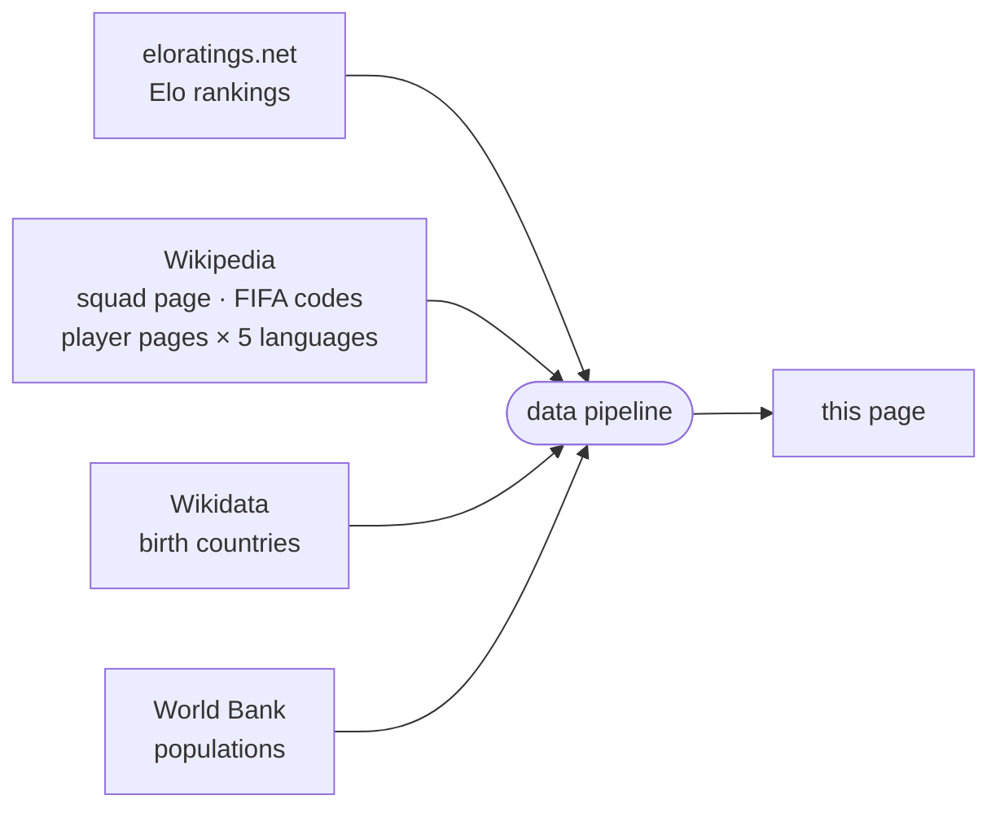

<!-- i18n:page_title -->
# Nato in / Gioca per
<!-- /i18n:page_title -->

<!-- i18n:intro -->
Questa mappa visualizza le rose dei Mondiali 2026 dal punto di vista del luogo di nascita.
Ogni paese è colorato in base al numero totale di giocatori del torneo nati lì —
che rappresentino quel paese o un altro.
<!-- /i18n:intro -->

<!-- i18n:quotes -->
## Le citazioni

L'intestazione mostra un carosello rotante di 15 famose citazioni letterarie —
da François Villon (1461) a Simone de Beauvoir (1949) — ognuna riscritta con umorismo
per sostituire l'espressione chiave originale con un termine di selezione calcistica.

Naviga tra le citazioni usando i chevron orientati verso sinistra, o scorri verso sinistra / destra su schermi touch.
Tieni premuto (o tieni premuto il pulsante del mouse) su una citazione per rivelare la riga originale; rilascia per tornare.
<!-- /i18n:quotes -->

<!-- i18n:control_sidebar -->
## Il pannello di filtro e ordinamento

Il pulsante <kbd style="background:var(--bg-hover,#f0ede8);border:1px solid var(--border,#e4e0d8);color:var(--text-muted,#999);border-radius:0 4px 4px 0">‹</kbd> nell'angolo in alto a destra dell'intestazione apre il pannello di filtro e ordinamento,
per controllare cosa appare sulla mappa e nell'elenco dei paesi.

*Matrice di filtro (destra) — clicca su un'intestazione di riga o colonna per attivare/disattivare un intero gruppo in una volta.* *Colonna di ordinamento (sinistra) — solo i primi due criteri sono attivi; fare clic su un criterio lo sposta in cima alla lista.*

### La matrice di filtro

La matrice incrocia due **colonne** (esportatore / non esportatore) con quattro **righe** in due gruppi:

- **Qualificati** — suddivisi in base al fatto che il paese importi giocatori o meno
- **Non qualificati** — suddivisi per appartenenza alla FIFA

Deseleziona una cella per nascondere quella categoria. Clicca su un'intestazione di riga o colonna per attivare/disattivare l'intero gruppo in una volta.

### Filtro alive & kicking

Il selettore **in · ● · out** si trova appena sotto l'intestazione di riga *qualificati*.
Per impostazione predefinita il cursore è centrato — vengono mostrati tutti i 48 paesi qualificati.

- Lato **in**: mostra solo le squadre ancora nel torneo; i paesi eliminati vengono nascosti.
- Lato **out**: mostra solo le squadre eliminate.
- Tocca di nuovo il lato attivo, o il centro, per reimpostare e mostrare tutto.

Su schermi touch, scorri verso sinistra o destra per spostare il cursore passo dopo passo.

Il selettore funziona in combinazione con il resto della matrice di filtro — puoi, ad esempio,
mostrare solo i sopravvissuti esportatori passando a **in** e deselezionando la colonna non-esportatori.

### Sul riferimento dei paesi

La mappa e l'elenco usano [eloratings.net](https://www.eloratings.net/) come fonte dei paesi —
non l'elenco dei membri FIFA. Ciò significa che l'elenco include territori non-FIFA come la Groenlandia,
ma anche casi particolari come le quattro nazioni britanniche — entità sub-nazionali
con la propria iscrizione alla FIFA, riconosciute separatamente sia dalla FIFA che da Elo.
L'ordinamento predefinito è per rating Elo; altri criteri di ordinamento sono disponibili nella colonna di ordinamento.
<!-- /i18n:control_sidebar -->

<!-- i18n:tax_heading -->
## Categorie di paesi
<!-- /i18n:tax_heading -->

<!-- i18n:tax_intro -->
Ogni paese è mostrato come una **pillola** il cui stile CSS ne codifica la categoria a colpo d'occhio.
<!-- /i18n:tax_intro -->

<!-- i18n:tax_label_qualified -->
Qualificato vs. non qualificato
<!-- /i18n:tax_label_qualified -->

  
    
    Czech Republic
  
  <!-- i18n:tax_desc_border_yes -->
Bordo pieno — qualificato e ancora nel torneo.
<!-- /i18n:tax_desc_border_yes -->

  
    
    Iran
  
  <!-- i18n:tax_desc_border_dashed -->
Bordo tratteggiato — qualificato ma eliminato.
<!-- /i18n:tax_desc_border_dashed -->

  
    
    Ukraine
  
  <!-- i18n:tax_desc_border_no -->
Nessun bordo — non qualificato.
<!-- /i18n:tax_desc_border_no -->

<!-- i18n:tax_label_fifa -->
FIFA vs. non-FIFA
<!-- /i18n:tax_label_fifa -->

  
    
    Iceland
  
  <!-- i18n:tax_desc_text_dark -->
Testo scuro — membro FIFA.
<!-- /i18n:tax_desc_text_dark -->

  
    
    Greenland
  
  <!-- i18n:tax_desc_text_light -->
Testo chiaro — non membro FIFA.
<!-- /i18n:tax_desc_text_light -->

<!-- i18n:tax_label_born -->
Nato qui / gioca per
<!-- /i18n:tax_label_born -->

  
    
    Italy
  
  ▶ <!-- i18n:tax_desc_exp -->
Giocatori nati in questo paese giocano per un altro paese qualificato.
<!-- /i18n:tax_desc_exp -->

  
    
    Curaçao
  
  ◀ <!-- i18n:tax_desc_imp -->
Giocatori nati in un altro paese giocano per questo paese.
<!-- /i18n:tax_desc_imp -->

  
    
    France
  
  ◀▶ <!-- i18n:tax_desc_both -->
Giocatori nati altrove giocano per questo paese, e giocatori nati qui giocano per altri paesi.
<!-- /i18n:tax_desc_both -->

<!-- i18n:tax_label_offmap -->
Fuori dalla mappa
<!-- /i18n:tax_label_offmap -->

<!-- i18n:tax_note_offmap -->
Ortogonale alle categorie precedenti.
<!-- /i18n:tax_note_offmap -->

  
    
    Singapore
  
  <!-- i18n:tax_desc_nomap -->
Nome in <em>corsivo</em> e bandiera attenuata — troppo piccolo per apparire sulla mappa.
<!-- /i18n:tax_desc_nomap -->

  
    
    Monaco
  
  <!-- i18n:tax_desc_nomap_nonfifa -->
Idem, qui combinato con non-FIFA.
<!-- /i18n:tax_desc_nomap_nonfifa -->

<!-- i18n:map -->
## La mappa

### Coropleta e bandiere

Ogni paese è colorato in base al numero totale di giocatori del Mondiale nati lì —
più il tono è scuro, più giocatori ci sono. I paesi dove non è nato nessun giocatore appaiono in un tono pallido neutro.
I paesi attualmente inclusi nel filtro mostrano un indicatore circolare con bandiera.

### Zoom e spostamento

Scorri (o pizzica) per zoomare · trascina per spostarti. Il pulsante  riduce lo zoom per mostrare tutti i paesi nella vista.
Quando un paese è selezionato, il pulsante  fa zoom e sposta per mostrare tutti i paesi evidenziati in una volta.

### La legenda

La barra dei colori in fondo all'intestazione va da scuro a chiaro da sinistra a destra,
con i valori di riferimento **66 · 55 · 35 · 15 · 0**.
La Francia (**99**, fuori scala) è mostrata come un punto nero indipendente a sinistra della barra.

### Tooltip

Passa il cursore su qualsiasi paese per vedere i dettagli. I tooltip non vengono mostrati su mobile.

- **Paesi di nascita**: conteggio delle esportazioni e giocatori principali, ognuno con la bandiera di destinazione
- **Paesi qualificati che reclutano anche**: una colonna a destra aggiunge il lato import
- **Paesi di nascita non qualificati**: un badge *non qualificato* sostituisce il pannello della rosa
<!-- /i18n:map -->

<!-- i18n:bottom_panel -->
## Il pannello inferiore

L'area scorrevole sotto la mappa ha tre schede.

###  L'elenco dei paesi

La scheda predefinita elenca ogni paese come pillola.
Il pannello di filtro e ordinamento controlla quali pillole appaiono e in quale ordine;
l'ordinamento predefinito è per [rating Elo mondiale](https://www.eloratings.net/).

Cliccare su una pillola seleziona quel paese e fa zoom sulla mappa.

Per i paesi con connessioni **nato qui / gioca per**, appaiono anche frecce colorate sulla mappa:

- {{ARROW_BLUE}} **frecce blu**: squadre che includono giocatori nati nel paese selezionato
- {{ARROW_RED}} **frecce rosse**: paesi dove giocatori nati altrove giocano per questa squadra

*Lo spessore delle frecce è proporzionale al numero di giocatori.*

Il pulsante  adatta poi tutti i paesi connessi nella vista.

Clicca di nuovo sulla pillola attiva, clicca altrove sulla mappa, o premi **Esc** per deselezionare.

### La tabella dei giocatori

Quando un paese è selezionato, la tabella dei giocatori mostra tre sezioni:

| Sezione | Contenuto |
|---|---|
| **Nato qui / gioca per un altro** | Giocatori nati in questo paese, raggruppati per la squadra che rappresentano |
| **Nato qui / gioca per questo paese** | Giocatori nati qui che rappresentano anche questo paese |
| **Nato altrove / gioca per questo paese** | Giocatori nati in un altro paese che rappresentano questa squadra, raggruppati per paese di nascita |

I nomi dei giocatori rimandano alla loro pagina Wikipedia nella lingua dell'interfaccia quando disponibile.

###  Catene

La scheda delle catene mostra sequenze di paesi collegati da connessioni nato-qui / gioca-per:
un giocatore nato in A gioca per B, un giocatore nato in B gioca per C — e così via,
formando una catena di nazionalità attraverso il torneo.
<!-- /i18n:bottom_panel -->

<!-- i18n:data_sources -->
## Fonti dei dati

| Fonte | Utilizzo |
|---|---|
| [eloratings.net](https://www.eloratings.net/) | Ranking Elo del calcio mondiale |
| [Wikipedia — rose Mondiali 2026](https://en.wikipedia.org/wiki/2026_FIFA_World_Cup_squads) | Nomi dei giocatori, presenze in nazionale |
| [API Wikipedia](https://en.wikipedia.org/w/api.php) | Pagina Wikipedia di ogni giocatore in 5 lingue (en, fr, de, it, es) |
| [Wikipedia — codici paese FIFA](https://en.wikipedia.org/wiki/List_of_FIFA_country_codes) | Appartenenza alla FIFA |
| [Wikidata](https://www.wikidata.org/) | Paesi di nascita |
| [Banca Mondiale](https://data.worldbank.org/) | Popolazioni dei paesi |

**La risoluzione del paese di nascita** è il passaggio più delicato del pipeline.
La pagina Wikipedia delle rose non indica dove sono nati i giocatori — fornisce solo i loro nomi
e i link alle loro pagine Wikipedia individuali.
Il pipeline usa quei link come chiavi per interrogare [Wikidata](https://www.wikidata.org/)
tramite SPARQL, recuperando il luogo di nascita registrato di ogni giocatore e il paese a cui appartiene quel luogo.
Questa ricerca in due fasi (Wikipedia → Wikidata) è ciò che rende possibile tracciare le connessioni nato-qui / gioca-per sulla mappa.

Queste fonti alimentano un pipeline automatizzato che unisce, incrocia e arricchisce i dati grezzi prima di pubblicarli su questa pagina.
I ranking Elo vengono aggiornati quotidianamente; i dati delle rose vengono aggiornati manualmente quando le selezioni cambiano.
<!-- /i18n:data_sources -->

