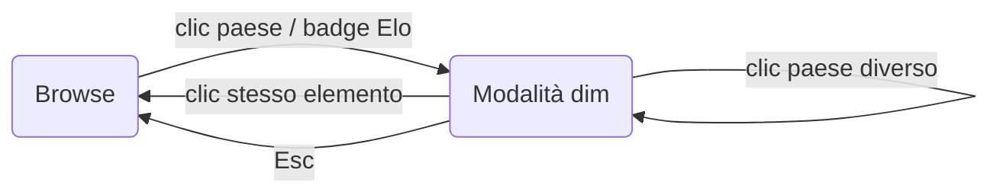

<!-- i18n:page_title -->
# Guida utente
<!-- /i18n:page_title -->

<!-- i18n:intro -->
Questa mappa visualizza le rose dei Mondiali 2026 dal punto di vista del luogo di nascita.
Ogni paese è colorato in base al numero di giocatori nati lì che rappresentano **un altro** paese
nel torneo, normalizzato per milione di abitanti.
<!-- /i18n:intro -->

<!-- i18n:control_sidebar -->
## Pannello di filtro e ordinamento

Il pulsante **‹** nell'angolo in alto a destra dell'intestazione apre il pannello di filtro e ordinamento,
che controlla quali paesi appaiono nell'elenco dei ranking Elo sotto la mappa.

*Colonna di ordinamento (sinistra) e matrice di filtro (destra) — clicca su un'intestazione di riga o colonna per attivare/disattivare un intero gruppo.*

### La matrice di filtro

Le righe raggruppano i paesi per stato di qualificazione; le colonne selezionano per ruolo export/import.
Clicca sull'intestazione di colonna `exp.` per mostrare solo i paesi esportatori;
clicca su `qualif.` per attivare/disattivare tutte le nazioni qualificate in una volta.
<!-- /i18n:control_sidebar -->

<!-- i18n:interaction_flow -->
## Modello di interazione

Clicca su qualsiasi paese sulla mappa — o su qualsiasi badge nell'elenco Elo — per entrare nella **modalità dim**:
le bandiere non correlate svaniscono, gli archi mostrano i flussi di esportazione, e la tabella dei giocatori appare sotto la mappa.

*Cliccare sullo stesso elemento riporta sempre a Browse.*

> **Suggerimento:** cliccare due volte sul badge Elo attivo cancella la modalità dim senza spostare la mappa.
<!-- /i18n:interaction_flow -->

<!-- i18n:data_sources -->
## Fonti dei dati

| Fonte | Utilizzo |
|---|---|
| Pagine delle rose [Wikipedia](https://wikipedia.org) | Nomi dei giocatori, paesi di nascita, presenze |
| [eloratings.net](https://www.eloratings.net/) | Ranking Elo del calcio mondiale |
| [Banca Mondiale](https://data.worldbank.org/) | Popolazioni dei paesi |
<!-- /i18n:data_sources -->
