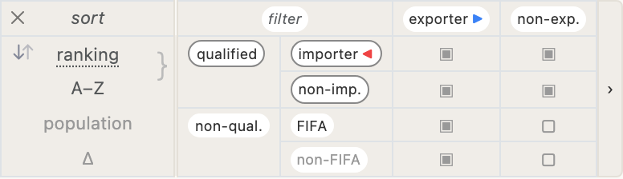
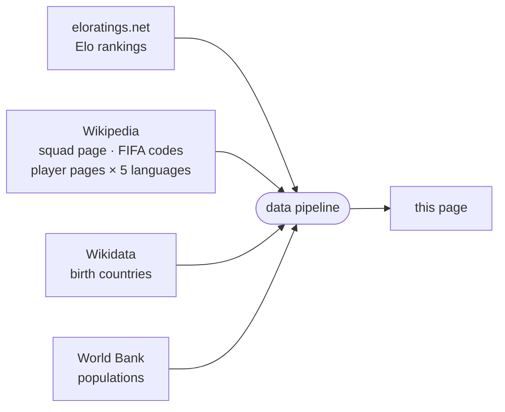

<!-- i18n:page_title -->
# Born In / Plays For
<!-- /i18n:page_title -->

<!-- i18n:intro -->
This map visualises the 2026 FIFA World Cup squads through the lens of birthplace.
Each country is shaded by the total number of World Cup players born there —
whether they represent that country or another.
<!-- /i18n:intro -->

<!-- i18n:quotes -->
## The Quotes

The header area shows a rotating carousel of 15 famous literary quotes —
from François Villon (1461) to Simone de Beauvoir (1949) — each playfully reworded
to swap the original key phrase for a football selection term.

Navigate between quotes using the left-oriented chevrons, or swipe left / right on touch screens.
Long-press (or hold the mouse button) on a quote to reveal the original line; release to go back.
<!-- /i18n:quotes -->

<!-- i18n:control_sidebar -->
## The Filter & Sort Panel

The <kbd style="background:var(--bg-hover,#f0ede8);border:1px solid var(--border,#e4e0d8);color:var(--text-muted,#999);border-radius:0 4px 4px 0">‹</kbd> button in the top-right corner of the header opens the filter and sort panel,
controlling what appears on the map and in the country list.

*Filter matrix (right) — click any row or column header to toggle a whole group at once.* *Sort column (left) — only the top two criteria are used; clicking a criterion moves it to the top of the list.*

### The filter matrix

The matrix crosses two **columns** (exporter / non-exporter) with four **rows** in two groups:

- **Qualified** — split by whether the country imports players or not
- **Non-qualified** — split by FIFA membership

Uncheck any cell to hide that category. Click a row or column header to toggle the whole group at once.

### About the country reference

The map and the list use [eloratings.net](https://www.eloratings.net/) as the source of countries —
not the FIFA member list. This means the list includes non-FIFA territories such as Greenland,
but also unusual cases like the four UK home nations — sub-national entities
with their own FIFA membership, recognised separately by both FIFA and Elo.
The default sort order is by Elo rating; other sort criteria are available in the sort column.
<!-- /i18n:control_sidebar -->

<!-- i18n:tax_heading -->
## Country Categories
<!-- /i18n:tax_heading -->

<!-- i18n:tax_intro -->
Every country is displayed as a **pill badge** whose CSS style encodes its category at a glance.
<!-- /i18n:tax_intro -->

<!-- i18n:tax_label_qualified -->Qualified vs. non-qualified<!-- /i18n:tax_label_qualified -->

  
    
    Czech Republic
  
  <!-- i18n:tax_desc_border_yes -->Solid border — qualified for the 2026 World Cup.<!-- /i18n:tax_desc_border_yes -->

  
    
    Ukraine
  
  <!-- i18n:tax_desc_border_no -->No border — not qualified.<!-- /i18n:tax_desc_border_no -->

<!-- i18n:tax_label_fifa -->FIFA vs. non-FIFA<!-- /i18n:tax_label_fifa -->

  
    
    Iceland
  
  <!-- i18n:tax_desc_text_dark -->Dark text — FIFA member.<!-- /i18n:tax_desc_text_dark -->

  
    
    Greenland
  
  <!-- i18n:tax_desc_text_light -->Light text — not a FIFA member.<!-- /i18n:tax_desc_text_light -->

<!-- i18n:tax_label_born -->Born here / plays for<!-- /i18n:tax_label_born -->

  
    
    Italy
  
  ▶ <!-- i18n:tax_desc_exp -->Players born in this country play for another qualified country.<!-- /i18n:tax_desc_exp -->

  
    
    Curaçao
  
  ◀ <!-- i18n:tax_desc_imp -->Players born in another country play for this country.<!-- /i18n:tax_desc_imp -->

  
    
    France
  
  ◀▶ <!-- i18n:tax_desc_both -->Players born elsewhere play for this country, and players born here play for other countries.<!-- /i18n:tax_desc_both -->

<!-- i18n:tax_label_offmap -->Off the map<!-- /i18n:tax_label_offmap -->

<!-- i18n:tax_note_offmap -->Orthogonal to the categories above.<!-- /i18n:tax_note_offmap -->

  
    
    Singapore
  
  <!-- i18n:tax_desc_nomap --><em>Italic</em> name and dimmed flag — too small to appear on the map.<!-- /i18n:tax_desc_nomap -->

  
    
    Monaco
  
  <!-- i18n:tax_desc_nomap_nonfifa -->Same, here combined with non-FIFA.<!-- /i18n:tax_desc_nomap_nonfifa -->

<!-- i18n:map -->
## The Map

### Choropleth & Flags

Each country is shaded by the total number of World Cup players born there —
the darker the shade, the more players. Countries with no players born there appear in a neutral pale tone.
Countries currently included in the filter display a circular flag marker.

### Zoom & Pan

Scroll (or pinch) to zoom · drag to pan. The  button zooms back out to fit all countries in view.
When a country is selected, the  button zooms and pans to fit all highlighted countries at once.

### The Legend

The colour bar at the bottom of the header runs dark-to-pale from left to right,
with reference tick values **66 · 55 · 35 · 15 · 0**.
France (**99**, far off scale) is shown as a standalone black dot to the left of the bar.

### Tooltips

Hover any country to see details. Tooltips are not shown on mobile.

- **Birth countries**: export count and top players, each with their destination flag
- **Qualified countries that also recruit**: a right-hand column adds the import side
- **Non-qualified birth countries**: a *not qualified* badge replaces the squad panel
<!-- /i18n:map -->

<!-- i18n:bottom_panel -->
## The Bottom Panel

The scrollable area below the map has three tabs.

###  The Country List

The default tab lists every country as a pill badge.
The filter & sort panel controls which badges appear and in what order;
the default sort is by [World Football Elo rating](https://www.eloratings.net/).

Clicking a badge selects that country and zooms the map to it.

For countries with **born-in / plays-for** connections, coloured arrows also appear on the map:

- ■ **blue arrows**: squads that include players born in the selected country
- ■ **red arrows**: countries where players born elsewhere play for this squad

The  button then fits all connected countries in view at once.

Click the active badge a second time, click anywhere else on the map, or press **Esc** to deselect.

### The Player Table

When a country is selected, the player table shows three sections:

| Section | Contents |
|---|---|
| **Born here / plays for another** | Players born in this country, grouped by the squad they represent |
| **Born here / plays for this country** | Players born here who also represent this country |
| **Born elsewhere / plays for this country** | Players born in another country who represent this squad, grouped by birth country |

Player names link to their Wikipedia page in the current interface language when available.

###  Chains

The chain tab shows sequences of countries linked by born-in / plays-for connections:
a player born in A plays for B, a player born in B plays for C — and so on,
forming a chain of nationalities across the tournament.
<!-- /i18n:bottom_panel -->

<!-- i18n:data_sources -->
## Data Sources

| Source | Used for |
|---|---|
| [eloratings.net](https://www.eloratings.net/) | World Football Elo rankings |
| [Wikipedia — 2026 World Cup squads](https://en.wikipedia.org/wiki/2026_FIFA_World_Cup_squads) | Player names, cap counts |
| [Wikipedia API](https://en.wikipedia.org/w/api.php) | Each player's Wikipedia page resolved in 5 languages (en, fr, de, it, es) |
| [Wikipedia — List of FIFA country codes](https://en.wikipedia.org/wiki/List_of_FIFA_country_codes) | FIFA membership |
| [Wikidata](https://www.wikidata.org/) | Birth countries |
| [World Bank](https://data.worldbank.org/) | Country populations |

**Birth country resolution** is the most delicate step in the pipeline.
The Wikipedia squad page does not list where players were born — it only provides their names
and links to their individual Wikipedia pages.
The pipeline uses those links as keys to query [Wikidata](https://www.wikidata.org/)
via SPARQL, retrieving each player's recorded place of birth and the country that place belongs to.
This two-step lookup (Wikipedia → Wikidata) is what makes it possible to draw the born-in / plays-for connections on the map.

These sources feed an automated pipeline that merges, cross-references,
and enriches the raw data before publishing it to this page.
Elo rankings are refreshed daily; squad data is updated manually when squads change.

<!-- /i18n:data_sources -->
