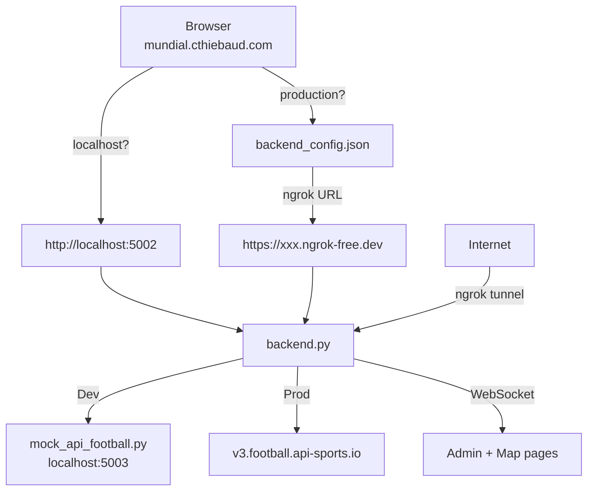

# server/

Backend for the Mundial app: API-Football proxy, Google Sign-In authentication, admin dashboard with live WebSocket updates, per-device session tracking, and force-kick.

## Setup

```bash
pip install flask flask-socketio requests
```

## Files

| File | Purpose |
|---|---|
| `backend.py` | Flask backend — API proxy, auth, WebSocket, serves login/admin pages |
| `mock_api_football.py` | Mock API-Football server for development (no API calls) |
| `admin.html` | Admin page — per-device session table with live login/logout/kick feed |
| `login.html` | Standalone Google Sign-In page (also used as popup from the map page) |
| `start.sh` | One-command startup: backend + ngrok + auto-publish URL to GitHub Pages |
| `users.json` | Persisted user history (gitignored) |
| `client_secret_*.json` | Google OAuth secret (gitignored) |

## Quick start

### Local development (auth-only, no API-Football)

```bash
API_FOOTBALL_KEY=mock python3 server/backend.py
```

### Local development (with mock API-Football)

```bash
# Terminal 1 — mock API-Football on port 5003
python3 server/mock_api_football.py

# Terminal 2 — backend on port 5002, pointing at mock
API_FOOTBALL_KEY=mock API_FOOTBALL_URL=http://localhost:5003 python3 server/backend.py
```

### Production (real API-Football + ngrok)

```bash
# Terminal 1
export API_FOOTBALL_KEY="your-key"
python3 server/backend.py

# Terminal 2
ngrok http 5002
```

Free API key: https://dashboard.api-football.com/register (100 requests/day, live endpoints only).

## URLs

### Local testing

| URL | What |
|---|---|
| `http://localhost:4040/wc2026_map_exported.html` | Main map page (nginx) — auth bar auto-detects `localhost:5002` |
| `http://localhost:5002/login` | Login page (served by backend) |
| `http://localhost:5002/admin` | Admin dashboard (served by backend) |
| `http://localhost:4040/wc2026_live_game.html` | Live game page (nginx) |

### Production (ngrok running)

| URL | What |
|---|---|
| `https://mundial.cthiebaud.com/wc2026_map_exported.html` | Main map page — reads ngrok URL from `backend_config.json` |
| `https://xxx.ngrok-free.dev/login` | Login page |
| `https://xxx.ngrok-free.dev/admin` | Admin dashboard |

## Endpoints

| Route | Method | Description |
|---|---|---|
| `/api/live` | GET | Live World Cup fixtures (proxied from API-Football) |
| `/api/lineups/<id>` | GET | Starting XI + substitutes for a fixture |
| `/api/auth/google` | POST | Verify Google Sign-In token, create session |
| `/api/auth/me` | GET | Current user from session |
| `/api/auth/logout` | POST | Clear session (accepts `{sid, email}` in body) |
| `/login` | GET | User login page |
| `/admin` | GET | Admin page (requires admin email) |
| `/api/admin/users` | GET | List all known users (admin only) |
| `/api/admin/online` | GET | List active sessions with device info (admin only) |
| `/api/admin/kick` | POST | Force-logout a session by `{sid}` or all sessions by `{email}` (admin only) |

### WebSocket events

| Event | Direction | Payload |
|---|---|---|
| `user_login` | server → client | `{email, name, picture, last_login, device, sid}` |
| `user_logout` | server → client | `{email, name, picture}` |
| `user_kicked` | server → client | `{email, sid?}` — if `sid` is present, only that session is kicked |

## Authentication

### Google Sign-In (popup flow)

The main map page uses a **popup** to sign in — the Google button is rendered on the backend origin (port 5002 or ngrok), avoiding origin mismatch issues.

1. User clicks "sign in" on the map page
2. A popup opens to `BACKEND/login`
3. User signs in with Google in the popup
4. Popup sends `postMessage({type: 'mundial_auth', user, admin, sid})` to the parent
5. Popup closes; parent stores user + session ID in `localStorage`
6. Admin page receives a `user_login` WebSocket event in real time

**Client ID:** `657438044008-qddq7m5mgk59k8qnhjpd6dalndqqb50e.apps.googleusercontent.com`

### Google Cloud Console setup

[Google Cloud Console → Credentials](https://console.cloud.google.com/apis/credentials) — Authorized JavaScript origins:

| Origin | Purpose |
|---|---|
| `http://localhost:5002` | Local dev (backend-served login/admin pages) |
| `https://mundial.cthiebaud.com` | Production (GitHub Pages) — not strictly needed since popup runs on backend origin |
| `https://xxx.ngrok-free.dev` | ngrok tunnel (update when URL changes) |

Note: `http://localhost:4040` is **not** needed — the map page uses the popup flow, so Google only sees the backend origin.

### Admin access

Controlled by `ADMIN_EMAILS` in `backend.py`. Currently: `christophe.t60@gmail.com`.

### Per-device session tracking

Each login creates a unique session ID and records the browser/OS from the `User-Agent` header. The admin page shows one row per active session (e.g. "Chrome / macOS", "Safari / macOS") with individual kick buttons.

Kicking a session by `sid` only logs out that specific browser. Kicking by `email` logs out all sessions for that user.

### Cross-origin auth (localStorage)

The map page and backend run on different origins. Since cross-origin cookies don't travel, the frontend stores `{user, admin, sid}` in `localStorage` after sign-in. The session ID is also stored separately as `mundial_sid` for logout/kick matching.

### Auth bar auto-hide

The map page hides the auth bar by default. On load, it pings the backend (3-second timeout). If the backend is unreachable, the auth bar stays hidden and the page works exactly as before — no broken UI.

## Architecture



### Backend URL discovery

The frontend auto-detects the backend:

- **`localhost` or `127.0.0.1`** → always uses `http://localhost:5002` (no config file needed)
- **Any other hostname** → reads `backend_config.json` from the repo root for the ngrok URL

This means `backend_config.json` only matters for production and never needs editing for local dev.

## Exposing to the internet (ngrok)

### One-time setup

```bash
brew install ngrok
ngrok config add-authtoken YOUR_TOKEN
```

### Port conflict with nginx

ngrok's web inspector defaults to port 4040, which conflicts with nginx. Fix by adding `web_addr` to ngrok config (`~/Library/Application Support/ngrok/ngrok.yml`):

```yaml
version: "3"
agent:
    authtoken: YOUR_TOKEN
    web_addr: localhost:4041
```

### Running

```bash
ngrok http 5002
```

ngrok gives a public `https://` URL tunneling to your local port 5002. WebSockets work through ngrok — use `{transports: ['websocket']}` on the client to avoid CORS issues with polling fallback.

**Remember:** add the new ngrok URL to Google OAuth authorized JavaScript origins each time it changes (free tier = ephemeral URL).

### Automated startup

`start.sh` does everything in one command:

1. Starts `backend.py`
2. Starts `ngrok http 5002`
3. Reads the public URL from ngrok's local API
4. Updates `backend_config.json` and pushes to GitHub

```bash
API_FOOTBALL_KEY=mock ./server/start.sh
```

### WiFi access

The backend binds to `0.0.0.0`, so other devices on your WiFi can reach it via your local IP (e.g. `http://192.168.1.54:5002`). Google Sign-In won't work from a private IP — use ngrok for auth testing from other devices.
