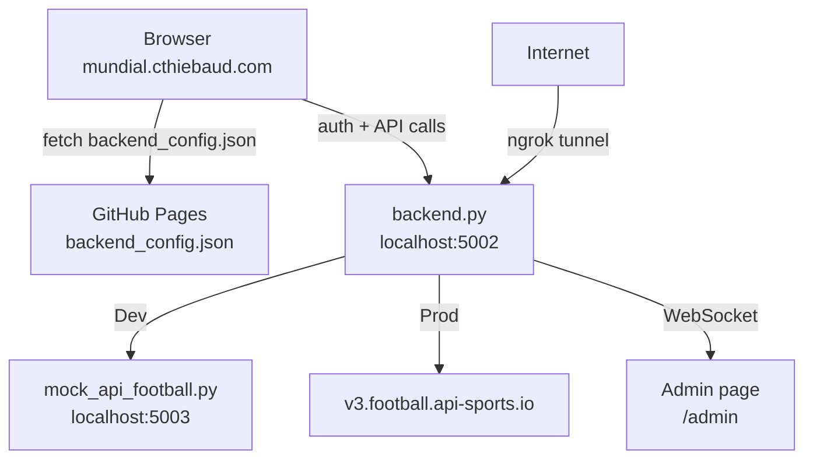

# server/

Backend for the Mundial app: API-Football proxy, Google Sign-In authentication, admin dashboard with live WebSocket updates.

## Setup

```bash
pip install flask flask-socketio requests
```

## Files

| File | Purpose |
|---|---|
| `backend.py` | Flask backend — API proxy, auth, WebSocket, serves login/admin pages |
| `mock_api_football.py` | Mock API-Football server for development (no API calls) |
| `admin.html` | Admin page — user table with live login/logout feed via WebSocket |
| `login.html` | Standalone Google Sign-In page |
| `start.sh` | One-command startup: backend + ngrok + auto-publish URL to GitHub Pages |
| `users.json` | Persisted user data (gitignored) |
| `client_secret_*.json` | Google OAuth secret (gitignored) |

## Quick start

### Local development (no API calls)

```bash
# Terminal 1 — mock API-Football on port 5003
python3 server/mock_api_football.py

# Terminal 2 — backend on port 5002, pointing at mock
API_FOOTBALL_KEY=mock API_FOOTBALL_URL=http://localhost:5003 python3 server/backend.py
```

### Local development (no mock needed for auth-only testing)

```bash
API_FOOTBALL_KEY=mock python3 server/backend.py
```

### Production (real API-Football)

```bash
export API_FOOTBALL_KEY="your-key"
python3 server/backend.py
```

Free API key: https://dashboard.api-football.com/register (100 requests/day, live endpoints only).

## Endpoints

| Route | Method | Description |
|---|---|---|
| `/api/live` | GET | Live World Cup fixtures (proxied from API-Football) |
| `/api/lineups/<id>` | GET | Starting XI + substitutes for a fixture |
| `/api/auth/google` | POST | Verify Google Sign-In token, create session |
| `/api/auth/me` | GET | Current user from session |
| `/api/auth/logout` | POST | Clear session |
| `/login` | GET | User login page |
| `/admin` | GET | Admin page (requires admin email) |
| `/api/admin/users` | GET | List all known users (admin only) |

### WebSocket events (admin page)

| Event | Direction | Payload |
|---|---|---|
| `user_login` | server → client | `{email, name, picture, last_login}` |
| `user_logout` | server → client | `{email, name, picture}` |

## Authentication

### Google Sign-In

Uses Google Identity Services (GSI) client-side library. The flow:

1. User clicks "Sign in with Google" on any page
2. Google handles the popup, returns a JWT credential
3. Frontend sends the JWT to `POST /api/auth/google`
4. Backend verifies the token with Google (`oauth2.googleapis.com/tokeninfo`)
5. User info is stored in session + persisted to `users.json`
6. Admin page receives a `user_login` WebSocket event in real time

**Client ID:** `657438044008-qddq7m5mgk59k8qnhjpd6dalndqqb50e.apps.googleusercontent.com`

### Google Cloud Console setup

Go to [Google Cloud Console → Credentials](https://console.cloud.google.com/apis/credentials) and add all origins that serve pages with the sign-in button to **Authorized JavaScript origins**:

| Origin | Purpose |
|---|---|
| `http://localhost:4040` | Local dev (main map page via nginx) |
| `http://localhost:5002` | Local dev (backend-served login/admin pages) |
| `https://mundial.cthiebaud.com` | Production (GitHub Pages) |
| `https://xxx.ngrok-free.dev` | ngrok tunnel (update when URL changes) |

### Admin access

Controlled by `ADMIN_EMAILS` in `backend.py`. Currently: `christophe.t60@gmail.com`.

### Cross-origin auth (localStorage)

The main map page (`localhost:4040` or `mundial.cthiebaud.com`) and the backend (`localhost:5002` or ngrok) run on different origins. Since cross-origin cookies don't work without HTTPS + SameSite=None, the frontend stores user info in `localStorage` after sign-in. This means:

- Sign-in state persists across page loads
- Works regardless of port/domain differences
- Sign-out clears both localStorage and the server session

## Architecture



### Backend URL discovery

The frontend doesn't hardcode the backend URL. Instead:

1. `backend_config.json` at the repo root contains `{"backend_url": "https://xxx.ngrok-free.dev"}`
2. The frontend fetches this file on page load to discover the backend
3. If the file is missing or the backend is unreachable, the auth bar stays hidden

For local development, set `backend_config.json` to:
```json
{"backend_url": "http://localhost:5002"}
```

## Exposing to the internet (ngrok)

```bash
# Install (one-time)
brew install ngrok

# Auth (one-time)
ngrok config add-authtoken YOUR_TOKEN

# Expose backend
ngrok http 5002
```

ngrok gives a public `https://` URL that tunnels to your local port 5002. WebSockets work through ngrok out of the box.

**Remember:** add the new ngrok URL to Google OAuth authorized JavaScript origins each time it changes (free tier = ephemeral URL).

### Automated startup

`start.sh` does everything in one command:

1. Starts `backend.py`
2. Starts `ngrok http 5002`
3. Reads the public URL from ngrok's local API
4. Updates `backend_config.json` and pushes to GitHub

```bash
API_FOOTBALL_KEY=mock ./server/start.sh
```

### WiFi access

The backend binds to `0.0.0.0`, so other devices on your WiFi can reach it via your local IP (e.g. `http://192.168.1.54:5002`). Google Sign-In won't work from a private IP though — use ngrok for auth testing from other devices.
